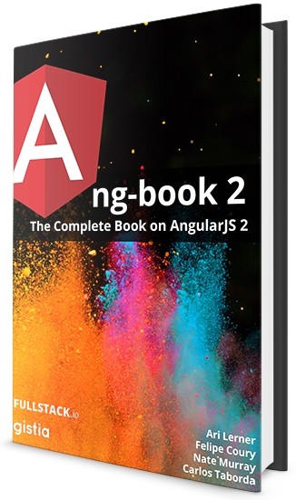
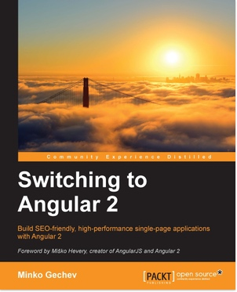
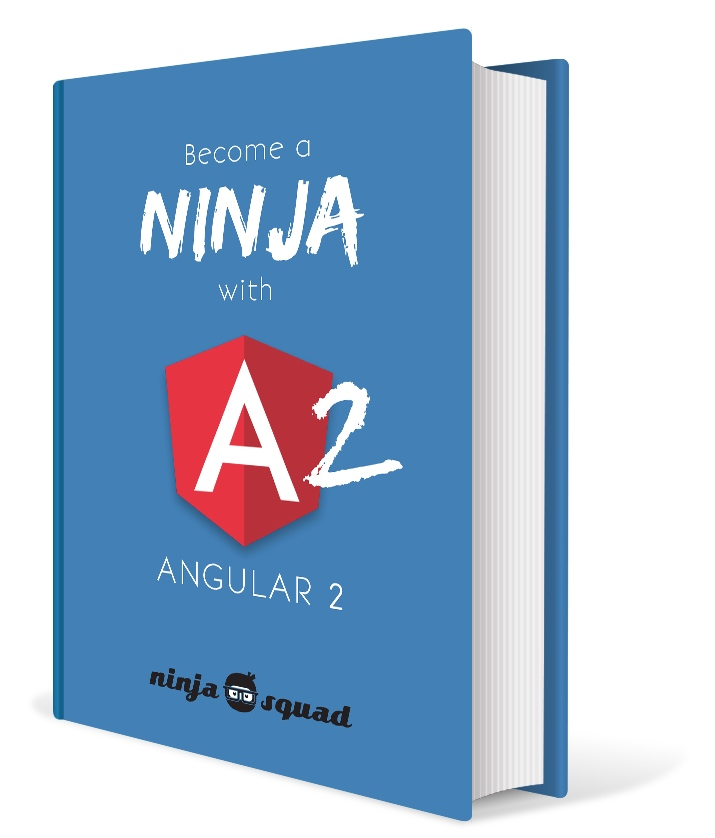

该指南，陈列和追踪关于 Angular 相关的书籍和它的进展。包括了书籍内容的大致讲解，对MEAP书籍后续进展的更新，还有不同书籍的侧重和优劣的对比，希望通过该指南我们可以对社区中优秀的 Angular 有个全局的认知和大局观。那么我们开始吧~

<!-- MarkdownTOC -->

- [ng-book 2](#ng-book2)
- [Switching to Angular 2](#switching-angular2)
- [Angular 2 Development with TypeScript](#angular2-with-ts)
- [Become a ninja with Angular 2](#angular2-ninja)

<!-- /MarkdownTOC -->


### <a name="ng-book2"> ng-book 2




传送门：
https://www.ng-book.com/2/

介绍：

stop wasting your time - wrestling with incomplete and confusing tutorials 不要浪费你的时间在那些不完整不及时更新的甚至令人困惑的教程上。

很多教程让你只见树木不见森林。it should shows how to fit all the picecs together

过期了。很容易过期尤其是这段时间angular准备上线之际，api 变动不小。

概念用词别扭。譬如 directive component 和 bare component 的区别是啥，在新angular中如何 one-way data binding.

这本书承诺的是：
1 get up and running quickly 快速上手
2 完整
3 最佳实践（如测试，代码组织，如何架构为后续性能等）
4 更新及时

该书自带的代码示例在github开源出来。 reddit-like voting app, chat app

书籍目录：

https://www.ng-book.com/media/ng2/ng-book-2-table-of-contents.pdf
[ng-book-2-table-of-contents](media/ng-book-2-table-of-contents.pdf)

该目录比较详细，能够看到讲解的主次分层。
该书第一章就通过 reddit-like voting app 的书写来近距离接触这个新框架。
在 How Angular Works 通过一个简单的产品（Navigation，Breadcrumb，Project List, ProductRow, ProductImage, ProductDisplay, ProductDepartment）的多组件的讲解来看看

```markdown
- Writing your first Angular 2 Web Application (1-54)
- TypeScript (55-70)
- How Angular Works(71-105)
- Built-in Components(107-122)
- Forms in Angular 2 (123-151)
- Data Architecutre in Angular 
- Data Architecture with Observables - Part1: Services
- Data Architecture with Observables - Part2: View Components
- HTTP
- Routing
- Advanced Components
- Converting an Angular 1 App to Angular 2
- Testing
- Changelog
```


评价：
来自于ngbook作者的2.0跟进~ ngbook作为首屈一指的angular社区的第一书（在国内2014年的velocity china 作者曾经来北京，之前老大有参与翻译这本书）


进展追踪：

该书籍目前在预售模式。
书籍的一些更新进展可以在 Twitter 获得


获取渠道：


### <a name="switching-angular2"> Switching to Angular 2





传送门：
https://www.packtpub.com/web-development/switching-angular-2

介绍：

一开始我们总体看下相对于1.x该框架有哪些新改变。然后快速过了下TypeScript的语法，然后看看这些怎么新语法特性怎么和ng2结合的。接着看了下change-detection的细节原理，现在的指令和组件是怎么改变我们组织代码的方式的，接着是angular 路由等。

We’ll start with an overview which sets the changes of the framework in context with version 1.x. After that, you will be taken on a TypeScript crash-course so we can take advantage of Angular 2 in its native, statically-typed environment. We’ll look at the new change-detection method in detail, how Directives and Components change how you create websites with Angular, the new Angular 2 router, and much more.


评价：
该书目前仅仅预期有250页左右。 作者介绍：He has developed numerous such projects, including AngularJS 1.x and Angular 2 style guides, angular2-seed, a static code analyzer for Angular 2 projects, aspect.js, angular-aop, and many others. 


目录：

```markdown
1: GETTING STARTED WITH ANGULAR 2
  - The evolution of the Web – time for a new framework
  - The evolution of ECMAScript
  - Lessons learned from AngularJS 1.x in the wild
  - Summary
2: THE BUILDING BLOCKS OF AN ANGULAR 2 APPLICATION
  - A conceptual overview of Angular 2
  - Changing directives
  - Getting to know Angular 2 components
  - Pipes
  - Change detection
  - Understanding services
  - Understanding the new component-based router
  - Summary
3: TYPESCRIPT CRASH COURSE
  - Introduction to TypeScript
  - Using TypeScript
  - TypeScript syntax and features introduced by ES2015 and ES2016
  - Meta-programming with ES2016 decorators
  - Writing modular code with ES2015
  - ES2015 module loader
  - ES2015 and ES2016 recap
  - Taking advantage of static typing
  - Further expressiveness with TypeScript decorators
  - Writing generic code by using type parameters
  - Writing less verbose code with TypeScript's type inference
  - Using ambient type definitions
  - Summary
4: GETTING STARTED WITH ANGULAR 2 COMPONENTS AND DIRECTIVES
  - The Hello world! application in Angular 2
  - Setting up our environment
  - Playing with Angular 2 and TypeScript
  - Using Angular 2 directives
  - Improved semantics of the directives syntax
  - Defining Angular 2 directives
  - Using Angular 2's built-in directives
  - Introducing the component's view encapsulation
  - Implementing the component's controllers
  - Handling user actions
  - Explaining Angular 2's content projection
  - Hooking into the component's life cycle
  - The order of execution
  - Defining generic views with TemplateRef
  - Understanding and enhancing the change detection
  - Summary
5: DEPENDENCY INJECTION IN ANGULAR 2
  - Why do I need Dependency Injection?
  - Dependency Injection in Angular 2
  - Configuring an injector
  - Defining factories for instantiating services
  - Child injectors and visibility
  - Summary
6: WORKING WITH THE ANGULAR 2 ROUTER AND FORMS
  - Developing the "Coders repository" application
  - Exploring the Angular 2 router
  - Using Angular 2 forms
  - Two-way data-binding with Angular 2
  - Storing the form data
  - Listing all the stored developers
  - Summary
7: EXPLAINING PIPES AND COMMUNICATING WITH RESTFUL SERVICES
  - Developing model-driven forms in Angular 2
  - Exploring the HTTP module of Angular
  - Defining parameterized views
  - Defining nested routes
  - Transforming data with pipes
  - Summary
8: DEVELOPMENT EXPERIENCE AND SERVER-SIDE RENDERING
  - Running applications in Web Workers
  - Initial load of a single-page application
  - Enhancing our development experience
  - Bootstrapping a project with angular-cli
  - Angular 2 quick starters
  - Summary
```

获取渠道：
https://www.packtpub.com/packtlib/book/Web%20Development/9781785886201/1


### <a name="angular2-with-ts"> Angular 2 Development with TypeScript

传送门：

https://www.manning.com/books/angular-2-development-with-typescript

介绍：

Angular 2 Development with Typescript teaches you what you need to start using Angular, while you also learn TypeScript and how to take advantage of its benefits. This hands-on book begins with an overview of Angular 2 architecture and an introduction to the online auction application that you’ll be developing throughout the book. You’ll learn TypeScript and how to write classes, interfaces, and generics, as well as how to transpile TypeScript code into today’s JavaScript that can be deployed in all Web browsers. More topics include data and views, user interaction with forms, and communicating with servers. Finally, you’ll learn how to test and deploy your Angular 2 applications.


目录：

```markdown

TABLE OF CONTENTS brief table of contents
1. INTRODUCING ANGULAR 2
  - 1.1. A Sampler of JavaScript Frameworks and Libraries
    - 1.1.1. Feature-Complete Frameworks
    - 1.1.2. Lightweight Frameworks
    - 1.1.3. Libraries
  - 1.1.4. What's Node.js
  - 1.2. High-Level Overview of AngularJS
  - 1.3. High-Level Overview of Angular
    - 1.3.1. Code Simplification
    - 1.3.2. Performance Improvements
  - 1.4. A Toolbox of the Angular Developer
  - 1.5. Introducing a Sample Online Auction
  - 1.6. Summary
2. TYPESCRIPT AS A LANGUAGE FOR ANGULAR APPLICATIONS
  - 2.1. Why Writing Angular Apps in TypeScript
  - 2.2. Getting Started With TypeScript
  - 2.2.1. Installing TypeScript Compiler
  - 2.3. TypeScript as a Superset of JavaScript
  - 2.4. Optional Types
  - 2.5. Functions
    - 2.5.1. Default Parameters
    - 2.5.2. Optional Parameters
    - 2.5.3. Arrow Function Expressions
  - 2.6. Classes
    - 2.6.1. Access Modifiers
    - 2.6.2. Methods
    - 2.6.3. Inheritance
  - 2.7. Generics
  - 2.8. Interfaces
    - 2.8.1. Declaring Custom Types with Interfaces
    - 2.8.2. Using the Keyword implements
    - 2.8.3. Using Callable Interfaces
  - 2.9. TypeScript Modules
  - 2.10. Adding the Class Metadata With Annotations
  - 2.11. The Type Definition Files
  - 2.12. Bringing Together TypeScript and Angular
  - 2.13. Overview of the TypeScript/Angular Development Process
  - 2.14. Summary
3. GETTING STARTED WITH ANGULAR
4. NAVIGATION WITH COMPONENT ROUTER
5. DEPENDENCY INJECTION
6. BINDING, EVENTS, AND COMPONENT LIFECYCLE
7. WORKING WITH FORMS
8. COMMUNICATING WITH SERVERS
9. TESTING ANGULAR APPLICATIONS
10. DEPLOYING ANGULAR APPLICATIONS
APPENDIXES
11. AN OVERVIEW OF ECMASCRIPT 6
12. OVERVIEW OF WEB COMPONENTS
```

评价：
目前进度是『all chapters available』
MEAP began October 2015 Publication in Summer 2016 (estimated)
330页左右

早就发行了MEAP（manning early access program），早期我的部分有参考它的如overview，toolchian，cheat sheet 等
该书有自己的读者论坛。https://forums.manning.com/forums/angular-2-development-with-typescript

作者介绍：Yakov Fain has been a developer for more than 25 years and has written multiple books on software development. Anton Moiseev has 8 years of software development experience, specializing in enterprise web applications.

获取渠道：


### <a name="angular2-ninja"> Become a ninja with Angular 2

传送门：


https://books.ninja-squad.com/angular2

介绍：
Angular 2 is the rewrite of the popular JS framework AngularJS. This ebook will help you getting the philosophy of the framework: what comes from 1.x, what has been introduced and why. You should be able to kickstart your project by the end of the reading, and build your amazing apps!

目录：

```markdown

0.  Introduction FREE
1.  A gentle introduction to ECMAScript 6 FREE
2.  Going further than ES6 FREE
  Dynamic, static and optional types
  Enters TypeScript
  A practical example with DI
3. Diving into TypeScript FREE
  Types as in TypeScript
  Enums
  Return types
  Interfaces
  Optional arguments
  Functions as property
  Classes
  Working with other libraries
  Decorators
4.  Web Components FREE
  A brave new world
  Custom elements
  Shadow DOM
  Template
  HTML imports
  Polymer and X-tag
5.  Grasping Angular’s philosophy FREE
6.  From zero to something FREE
  Building a TypeScript app
  Our first component
  Bootstrapping the app
  Something better with angular-cli
7.  The templating syntax
  Interpolation
  Using other components in our templates
  Property binding
  Events
  Expressions vs statements
  Local variables
  Structural directives (NgIf, NgFor, NgSwitch)
  Other template directives (NgStyle, NgClass)
  Canonical syntax
8.  Dependency injection
  DI yourself
  Easy to develop
  Easy to configure
  Other types of provider
  Hierarchical injectors
  Binding multiple values
  DI without types
9.  Pipes
  Pied piper
  json
  slice
  uppercase
  lowercase
  number
  percent
  currency
  date
  async
  Creating your own pipes
10.  Reactive Programming
  Call me maybe
  General principles
  RxJS
  Reactive programming in Angular 2
11.  Building components and directives
  Introduction
  Directives: selectors, inputs, outputs, lifecycle, providers, host, export as
  Components: view providers, change detection, queries, template, styles, encapsulation, directives, pipes
  Making a component available everywhere
12.  Services
  Title service
  Making your own service
13.  Testing your app
  The problem with troubleshooting
  Unit tests
  Fake dependencies
  Testing components
  End to end tests
  Performance tests
14.  Forms
  Forms, dear forms
  Model driven
  Template driven
  Adding some validation
  Errors and submission
  Creating a custom validator
  Grouping fields
  Reacting on changes
  Summary
15.  Send and receive data with HTTP
  Getting data
  Transforming data
  Advanced options
  Jsonp
  Tests
16.  Router TO DO
  En route
  Navigation
  Parameters
  Licecyle
  Nested components
  Auxiliary routes
  Async routes
  Listening to URL changes
  Location
  Path or Hash
  RouteData
17.  Migration to Angular 2 TO DO
18.  Advanced concepts TO DO
  Advanced Directives
  Zones
  Web Workers
  Server-side rendering
  Targetting mobile
  Performance optimization
```

评价：
目前184页（A4纸大小），已经有1.6k的付费用户（1

该书的目录结构比较类似于我们现在书籍的目录结构。同时对一些知识点有单独讲述如从ES6，TypeScript（比ES6多的那部分），Web Component，Reactive Programming等
同时最后一章的advanced concepts高级概念对于一些中级读者还是比较有吸引力的。

获取渠道：

[Become_a_ninja_with_Angular2_sample](media/Become_a_ninja_with_Angular2_sample.pdf)


