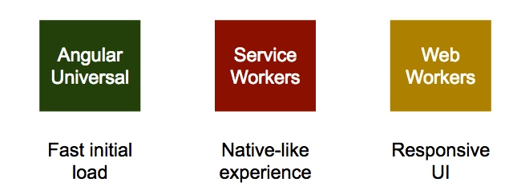
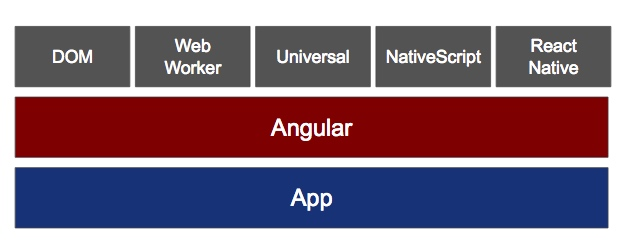
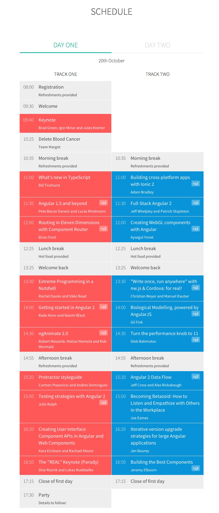
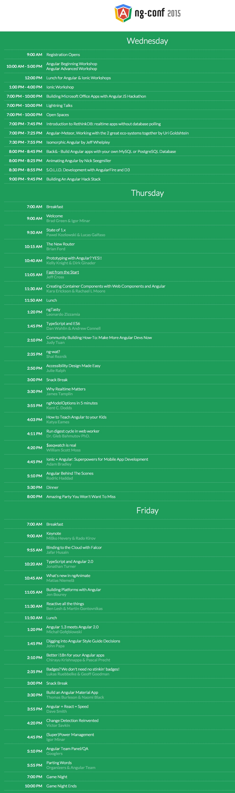

该份指南对当前较为热门的开发者大会中进行追踪和学习。譬如该大会中分享的技术点，不同的topics话题，不同公司的实践产品和做法，还有前言技术研究和探索等进行罗列和讲述。

<!-- MarkdownTOC -->

- [ngconf 2016](#ngconf-2016)
- [其他会议](#other-confs)
- [angular-connect](#angular-connect)
- [ngconf 2015](#ngconf-2015)

<!-- /MarkdownTOC -->

### <a name="ngconf-2016"> ngconf 2016

https://www.youtube.com/watch?v=mAjjI35RcUE

ng-conf is a three day, single track conference focused on delivering the highest quality training in the Angular JavaScript framework. Developers from across the country will converge on beautiful Salt Lake City, UT to participate in training sessions by the Google Angular team, and other Angular experts.

地址：犹他州盐湖城
时间：2016年5月4-6日

Angular 2 Workshop sponsored by Google Cloud Platform 

#### Wednesday 5/4/2016：
-------

Keynote 1
An Angular 2 Force Awakens
Angular 2's Fresh Approach to Style
TypeScript: Angular 2's Secret Weapon
Angular 2 Universal Patterns
Adjusting the Dials in the Circuits of the Human Brain with Deep Brain Stimulation

Routing
Components, Components, Components! ... and Angular 1.5
Look Deeply Into Your App with Augury (formerly known as Batarangle)
The ng-show: Angular 2

Angular Material: Titanium Octopus
Testing all your Tasks
Functional Reactive JavaScript- Let's stop the Conversational Remorse!
Rockin' 'Round The Docs
Sharing Code Between Web and Native Apps
Generative Art in Angular 2
Progressive Web Apps

#### Thursday 5/5/2016：
-------------

Keynote 2
ng-conf newsroom
Various Fair Day Activites
Becoming an Angular 2 Contributor - Fair Day Workshop
Migrating Angular 1 Apps to Angular 2 - Fair Day Workshop
Get that Corner Office with Angular and Electron - Fair Day Workshop
Contributing to the Angular 2 Documentation - Fair Day Workshop
Up and Running with Ionic v2! - Fair Day Workshop
Smarter Navigation With The Component Router - Fair Day Workshop
Angular Air Recording
Look Deeply Into Your App with Augury (formerly known as Batarangle). - Fair Day Workshop

Implement Single Sign-On with Auth0 - Fair Day Workshop
Wanting it all vs. Being Great
Typescript 2 in 60ish Minutes - Fair Day Workshop
Angular Air Broadcast
Deploy your Angular apps on Google Cloud Platform - Fair Day Workshop
Angular 2 in 60ish Minutes - Fair Day Workshop
Angular + Webpack <3 - Fair Day Workshop
Science Fair
Form.io
Sauce Labs
Horizon: a scalable Rethinkdb backend for realtime web apps - Fair Day Workshop
Isolating and Improving performance in Angular 1 Applications
Building Native iOS and Android Apps With Angular 2 and NativeScript - Fair Day Workshop
Code Lab: New Data Architecture in Angular 2

Climbing into Elm - Fair Day Workshop
Unit Testing with Angular 2
Angular 2 Server-side Rendering (Angular 2 Universal) - Fair Day Workshop
Angular 2 libraries, it's time to code - Fair Day Workshop
Rangle Mini Party
VMware Mini Party
Capital One Mini Party
Game Night, Starcraft Tournament
ng-game room sponsored by VMware

#### Friday 5/6/2016：
-------

Typescript
Promises are probably older than you.
​Pipe Hype
Multi-Slot Transclusion
Animations
Learn Clingon
Angular 2 for the rest of us
React Native

Reactive Programming, changing the world at Netflix, Microsoft, Slack and beyond!
Async data patterns with AngularFire
Unhappiness at Work
Demystifying Decorators
Becoming an Angular 2 Contributor

Reactive Angular2 with ngRx
It's Just a Textbox, What Could Go Wrong?: Angular 2 Forms and Validation
Automated Angular 2 Style Checking with Codelyzer
Enhancing performance without steroids
Code Generation
Angular Team Panel/QA

### <a name="other-confs"> 其他会议和Topics

Angular @ Fluent 2016 - Angular 2 and the future of HTML5 apps

https://www.oreilly.com/ideas/angular-2-and-the-future-of-html5-apps
https://docs.google.com/presentation/d/1fF4wawmS52AZnbFtSiclLs9-9ifBk_ki2whsNYxqobc/edit#slide=id.p

对于一些如Alternative renders, web workers, vm turns, service workers, http/2, push notifation 等进行

1 progress on performance(ultrafast change detection -> re-render with view pool -> code gen) - (faster bootstrap, smaller framework, pay as you go, obviously fast 等)

2 progressive web apps(auto-install, launch icon, 结合 service workers 实现cache, sync, offline, 通过angular universal 实首次加载, web workers responsiveness )

### <a name="angular-connect"> Angular Connect 2015

官网地址：http://angularconnect.com/schedule
时间：20 & 21 OCTOBER 2015
地址：大伦敦

sessions 一览：

keynote ：
回顾框架当前的境地，未来的一些瞎想和演化过程一路走来的看点。
 

The real keynote(parody)：
带领我们看下当前的web开发现状和Angular 开发者一些注意点。take us on a non-sensical “tour” of the current web development landscape as it relates to the Angular developer。

What's new in TypeScript:
好的工程需要好的语言来辅助。  improvements in the TypeScript toolchain, compiler, and language, and how they help you write better Angular apps.

Angular 1.5 and beyond:
2015底是个激动人心的时间段，因为Angular2.0快要面世了(approaches production). 在1.5中看下这些大量个更新中是如何支持后续的更新了（升级友好的版本）。(how people might choose to upgrade from angular 1 to angular 2)

full-stack angular：
讲述Angular 2 中那些酷炫的tools 跑在server端带来更多好玩的更多可能性。（now available in Angular 2 to build ultra-fast, powerful full-stack applications.）

Creating WebGL components with Angular：

Building native mobile apps with Angular 2.0 and NativeScript:
讲解为什么 NativeScript是特别的（direct access to native APIs. no plugins required, native performance through the use of js bridge natively, style native apps using CSS.）

Angular Material in practice:
"Write once, run anywhere" with nw.js & Cordova: for real!:

Biological Modelling, powered by AngularJS:
Todo(ng1)

Getting started in Angular 2:
Agunlar2 关键概念的上手指南 『cross-component communication, data rendering, user input handling, and url routing all work together as we build a functioning app.』

ngAnimate 2.0:
崭新的system,功能强大的动画书写体验，rich sequencing, extensive CSS manipulation, solid plugin architecture and support for interactive animation via animation timelines. 

Turn the performance knob to 11：
Todo (ng1)

Protractor styleguide:
Todo(end-to-end test)

Angular 2 Data Flow:
pipe, new name for angular1's filter?, $scope.$digest()循环还存在吗, event fires and subscribe 机制还这样吗？ 听述 new ideas and tools to help data flow more naturally through App（新理念和工具来帮助App内的数据流运转的更好）

Testing strategies with Angular 2：
Angular loves testability(看DI，protactor 就知道啦) ，这次看看官方怎么测试利用新的test helpers for angular 2 components

Becoming Betazoid: How to Listen and Empathize with Others in the Workplace:
todo

Creating user interface component APIs:
todo

Iterative version upgrade strategies for large angular applications:
讨论Angular版本升级策略（in-production projects 如何一步步从1.3, 1.4, 1.5），使用新的Angular router， 提供Angular2的升级帮助

building best components:
组件是Angular2.0中的新的原子单元. 提供建议和区分点（与1.x中的directives），不同类型的测试来回归。

building cross-platform apps with ionic 2:
review了 ionic2 的新特性,两个好基友齐头并进，各种方式来优化性能！！

routing in eleven dimensions with component router:
component router 是1，2的新router系统。 如何利用它来组织代码，解释了linking DSL, to make use of lifecycle hooks 生命周期的钩子。讨论了高级特性和auxiliary辅助备用 routing 

Modern authentication solutions with OAuth 2.0, OpenId Connect:
(ng1) Todo

These are not the models you're looking for:
我们绝大多数是用 plain javascript object 来建模对象，本session提供 prototype和 classes如何来让models更加smarter和易于使用维护。

TypeScript tooling for great productivity:

Cutting Angular's crosscuts:
AOP 切面编程模式如何来帮助 object-oriented paradigm 来减少重复代码（如Logging and authorisation）. 利用 ES7 decorators's syntax

Building performant components for Angular:
(ng1) - 

Modularity and packaging for angular applications:
es6 modules 来帮助架构代码， 和一些面临的挑战和策略（developing, packaging, and deploying）不同工具的优缺点

Creating realtime apps with Angular2 and Metor:
两大王者珠联璧合。讨论整合的细节， 

sign up journey - 为百万用户构建高级的表单：
(ng1) sexy way to display multiple kind of input files, 不同的验证策略(in hierachical, structural, scalable way), 出错提示(real-time contextual feedback 等)
 
Using Web Workers for more responsive apps：
angular's split rendering structure 分离的render结构，让我们可以把渲染和Angular逻辑分离( on a separate processor core via Web Worker) 

Better concepts, less code in Angular 2:
引入的新概念如何帮助我们写出更精简的代码（通过书写一个复杂的widget, 来展示类似 content projection, querying for directives, 异步控制流async control flow 等特性）

How to design large AngularJS applications that scale:
(ng1) 提出用于构建大型项目的常用设计模式。 to combine microservices with an underlying unidirectional data-flow and drastically reduce directive responsibilities 结合大量的微服务和底层单向数据流，来减少directive的职责. 并且提出向Angular2迁移的建议。

ngDarwinAward:
为什么鬼，Angular界的达尔文奖？！

Optimize yourself: 5 keys traits of high-performing humans:
被新技术挑战（每个项目需要新的不同的技术，你需要快速掌握），所以要保持高效，进入状态，参与感和保持快乐，如何做到通过日常的改进来给自己的职业生涯和生活带来些改变。

D3 in Angular, Angular in D3:
你中有我我中有你与D3.

Building apps with firebase and angular2:
啦啦啦广告时间， 讲 firebase 这个 backend-less （to add backend to app in minutes）

Protractor, ES6 Generators and Co.js：
如何利用 es6新的generators和Co library 实现 simple简单，可预测的 端到端测试流

RxJs in-depth
RT 如题讲 reactive programming 的

Getting Comfortable Being Uncomfortable：
卧槽，职业规划啊。 from a bootcamp grad, to full time, full stack javascript （从新兵训练营出来的一年时间成为厉害的全栈工程师）. 体验下 renewed passion for the incredible industry

Debugging Angular 2 Apps with Batarangle：
结合之前众多开发框架辅助工具的（to combine the best ideas from Batarang, ng-inspector, React Developer Tools, and Ember Inspector as well adding a few extras.） - 看看 Batarangle 是如何实现的，Use case使用案例等等

Extreme Programming in a Nutshell：
Todo: 讲 XP极限编程的

Using AngularJS on LG and PlayStation:
LG 和 Sony PS游戏机上的 supporting multiple devices and creating a single codebase 的新实践

### <a name="ngconf-2105"> ngconf 2015

官网地址： http://www.ng-conf.org
视频播放地址：https://www.youtube.com/playlist?list=PLOETEcp3DkCoNnlhE-7fovYvqwVPrRiY7

日期：March 5th–6th, 2015
地址：犹他州的盐湖城 salt lake city

Wednesday 日程：workshop 和sponsor赞助商
Introduction to RethinkDB: realtime apps without database polling:

Angular-Meteor, Working with the 2 great eco-systems together by Uri Goldshtein:

Isomorphic Angular by Jeff Whelpley:

Animating Angular by Nick Seegmiller:

Building An Angular Hack Stack:

Thursday 日程：
Welcome by Brad Green & Igor Minar:

State of 1.x:

The new router:

prototyping with Angular? YES!:

Fast from start:

Creating container components with web components and angular:

TypeScript and ES6:

Why realtime matters:

ngModelOptions in 5 minutes:
讲解了新加入的ng-model-options: debounce, updateOn(default, blur 等) 

run digest cycle in web worker:

$asqwatch is real:

ionic +Angular: superpowers for mobile app development:

Angular behind the scenes:

Friday 日程：
keynote by Misko Hevery & Rado Kirov:

Binding to the cloud with Falcor:

TypeScript and Angular 2.0:

What's new in ngAnimate:

Building platforms with Angular:

Reactive all the things:

Angular 1.3 Meets Angular 2.0:

Digging into Angular Style Guide decisions:

better i18n for Angular app:

Angular + React = Speed:

Build an Angular Material App:

Change detection reinvented:

Angular Team Panel/QA:

喜闻乐见的核心团队的Q&A环节

