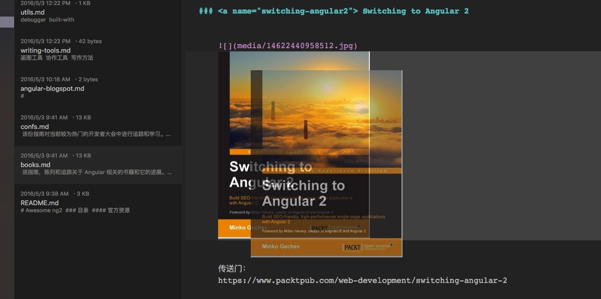
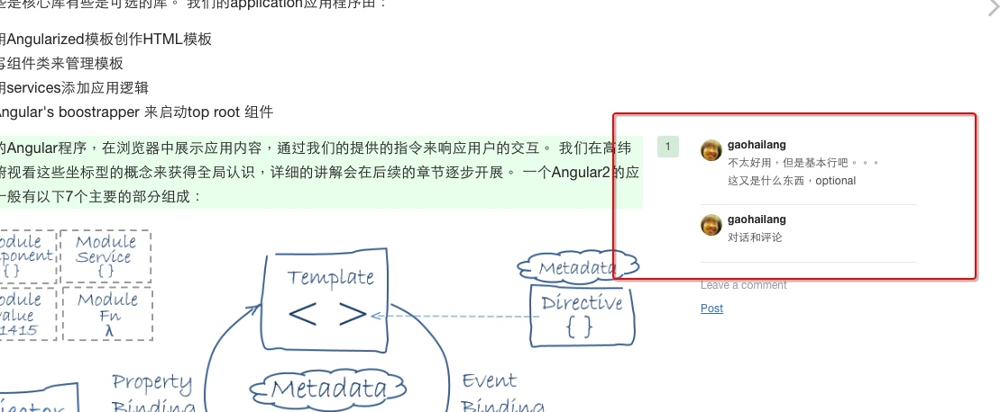
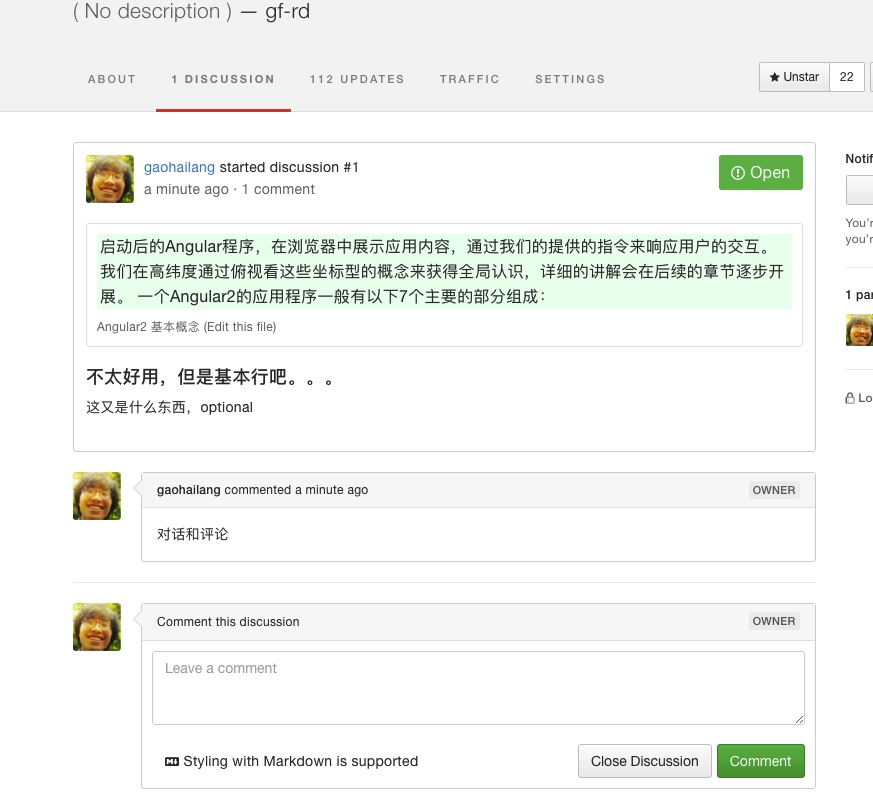
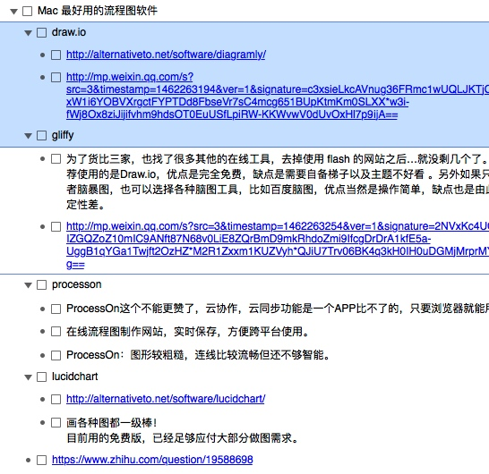
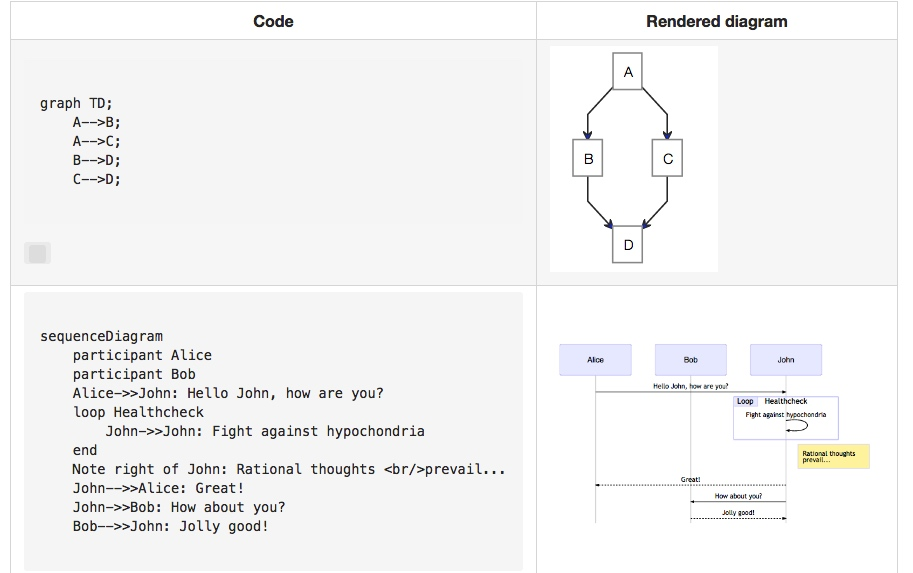
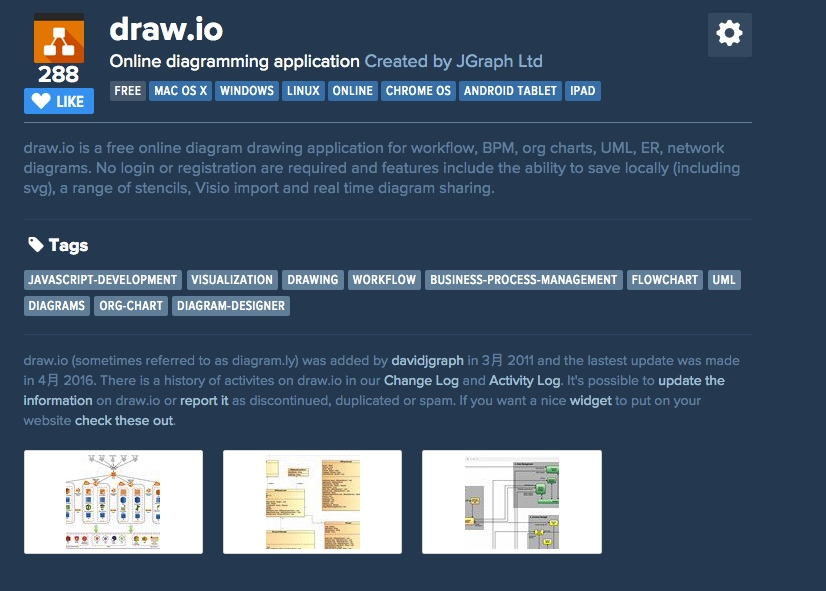
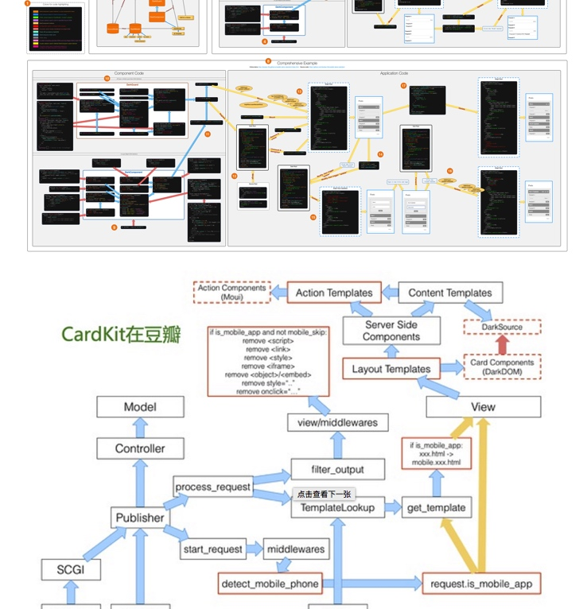
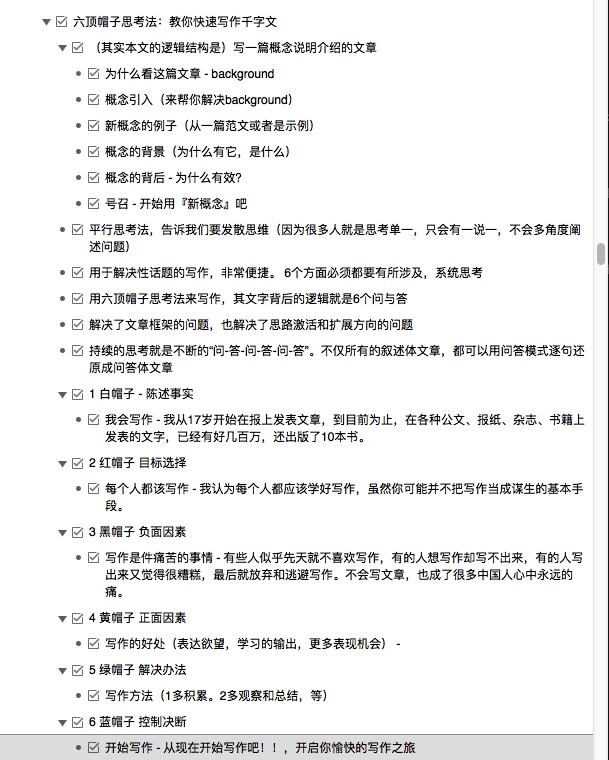

### 书写工具

我们希望我们的书稿文字都以 markdown 的形式提供，这种格式好处不需多说了。

#### 本地编写
在本地编写推荐 MWeb Lite 来实施（最棒的是解决了图片等资源可以copy&paste,drag&drop的方式添加，而且可以在编辑界面的时候就能 preview. 

推荐做法，修改或添加文本后，通过git 提交的方式同步到我们的git库

#### 在线编写
当然可以直接通过 gitbook 提供的编辑器来，但是这样会造成很多无意义的commit（污染git 提交）同时添加图片也没有那么方便

#### Review
当我们提供好基础草稿draft等后，我们就可以开始对我们的内容进行审核了。通过开启gitbook comment来实现inline comment*（选中你要评论的文字，然后在文章的右侧栏有+，点击后可以添加评论）

对于其他非inline的评论，如通用建议，内容建议等可以在discussion tab页来添加。

### 画图工具

画图工具有不少，有在线Web版也有软件版，有颜值高的也有功能强的。有可视化编辑的也有文本描述的。选一款让团队满意并且功能好用的着实不好办。

我们建议在一开始通过 mermaid 来用文本的形式来表达自己的想法（如果觉得受限，可以通过喜欢的软件甚至圈画来提供草稿版的图表UML图等

在对比了 draw.io, gliffy, lucidchart, processon 后，最终选择了 processon 来构建。我们觉得它在制图和协作上达到了比较好的平衡（建议有专门的制图同学负责统筹制作如图表颜色，大小，文字，风格等细节确认）

Generation of diagram and flowchart from text in a similar manner as markdown http://knsv.github.io/mermaid/

### 写作思考

MUCE

金字塔

六顶帽子

